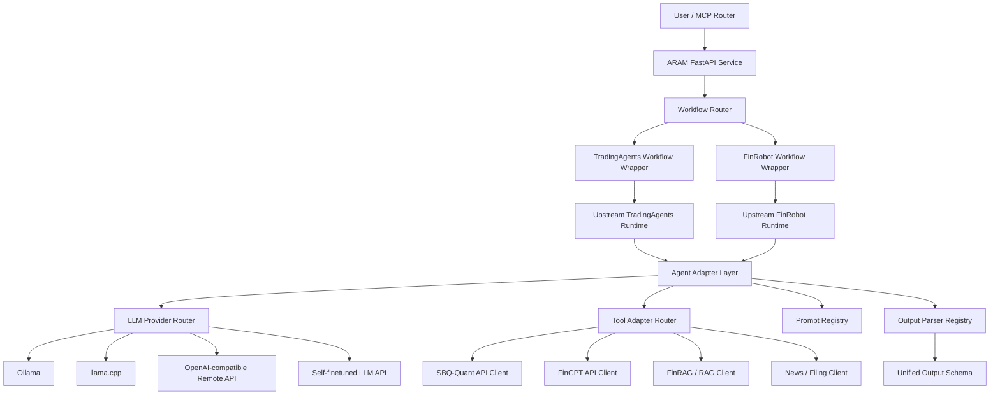

# ARAM (Agentic Research Analysis Machine) 系統規劃文件

> Version: v0.2  
> Scope: ARAM repository only  
> Design principle: preserve upstream FinRobot and TradingAgents workflows; replace agents, prompts, models, tools, and output parsers through adapters.  
> Excluded: SBQ-Quant implementation. SBQ-Quant is treated as an external service provider.

---

## 0. Executive Summary

This repository, `ARAM`, is not intended to be a new from-scratch multi-agent orchestration framework.

The correct target design is:

```text
ARAM
= TradingAgents workflow wrapper
+ FinRobot workflow wrapper
+ agent replacement layer
+ prompt override layer
+ LLM provider router
+ tool adapter layer
+ unified output parser
+ MCP-compatible API surface
```

The repository should **preserve the original workflow logic** of:

- TradingAgents for trading decision, analyst debate, trader decision, and risk review.
- FinRobot for financial research workflow, equity research report generation, and investment thesis construction.

The main extension point is not the workflow graph itself.  
The main extension point is **agent substitution**:

```text
Original upstream workflow agent
        ↓
Agent Adapter
        ↓
Custom Prompt / Custom LLM API / Custom Tool / Custom Parser
        ↓
Same upstream workflow continues
```

This allows the system to:

1. use TradingAgents and FinRobot without rewriting their overall structure;
2. swap individual agents with custom prompts;
3. swap LLM backend from OpenAI to Ollama, llama.cpp, or self-finetuned model APIs;
4. replace specific agents entirely with API agents, such as FinGPT sentiment models;
5. route all workflows through a single MCP-compatible service;
6. preserve reproducibility through trace logging and schema validation.

---

## 1. External GitHub Repositories Used

| Repository | URL | Role in ARAM |
|---|---|---|
| TradingAgents | https://github.com/TauricResearch/TradingAgents | Primary trading decision workflow; preserve analyst / debate / trader / risk manager structure |
| FinRobot | https://github.com/AI4Finance-Foundation/FinRobot | Primary financial research and equity report workflow; preserve Data-CoT / Concept-CoT / Thesis-CoT style design |
| FinGPT | https://github.com/AI4Finance-Foundation/FinGPT | Financial LLM and sentiment / news / text analysis model source |
| FinNLP | https://github.com/AI4Finance-Foundation/FinNLP | Financial NLP data ingestion and preprocessing reference |
| FinRAG | https://github.com/AI4Finance-Foundation/FinRAG | Financial RAG reference for document/news/filing retrieval |
| Ollama | https://github.com/ollama/ollama | Default local LLM backend for personal use and GGUF-based models |
| llama.cpp | https://github.com/ggml-org/llama.cpp | Advanced GGUF inference backend; useful for direct control over model serving |
| LangGraph | https://github.com/langchain-ai/langgraph | Optional supervisor/checkpoint layer only; not the primary workflow engine |
| FastAPI | https://github.com/fastapi/fastapi | API service layer |
| Pydantic | https://github.com/pydantic/pydantic | Config and schema validation |
| MCP Python SDK | https://github.com/modelcontextprotocol/python-sdk | MCP server/tool interface reference |

---

## 2. Non-Goals

The coding agent must not implement the following unless explicitly requested later.

| Non-goal | Reason |
|---|---|
| Rebuild TradingAgents workflow from scratch | We want to preserve upstream structure |
| Rebuild FinRobot workflow from scratch | We want to preserve upstream structure |
| Make LangGraph the main workflow engine | Current design uses upstream workflows as the primary execution engine |
| Put all agents into one custom mega-workflow | TradingAgents and FinRobot should remain two separate workflow families |
| Let LLM directly determine final portfolio weights without validation | Final weights should be generated or validated by SBQ-Quant / FinRL-X / optimizer layer |
| Implement SBQ-Quant internals | SBQ-Quant is already completed and should be accessed through API clients |
| Couple a workflow to a single model provider | LLM backend must be replaceable via provider adapters |
| Hard-code prompt text inside Python code | Prompts should be YAML/Markdown files in `prompts/` |
| Hard-code output parsing logic into agent code | Parsers should be versioned and schema-driven |

---

## 3. Core Design Philosophy

### 3.1 Preserve Workflow, Replace Components

The primary rule:

```text
Do not rewrite the original workflow if an adapter can replace the component.
```

| Layer | Preserve? | Replaceable? | Example |
|---|---:|---:|---|
| TradingAgents workflow order | Yes | No, unless necessary | analyst → debate → trader → risk manager |
| FinRobot research workflow order | Yes | No, unless necessary | data → concept → thesis → report |
| Individual agent prompt | No | Yes | replace technical analyst prompt |
| Individual LLM backend | No | Yes | OpenAI → Ollama / llama.cpp / custom API |
| Individual agent implementation | No | Yes | sentiment analyst → FinGPT API agent |
| Tool client | No | Yes | yfinance → SBQ-Quant data API |
| Output format | No | Yes | free text → validated JSON + Markdown |

---

## 4. High-Level Architecture



---

## 5. Repository Structure

```text
ARAM/
├── README.md
├── pyproject.toml
├── .env.example
├── docker-compose.yml
│
├── app/
│   ├── main.py
│   ├── dependencies.py
│   ├── routes/
│   │   ├── health.py
│   │   ├── workflows.py
│   │   ├── tradingagents.py
│   │   ├── finrobot.py
│   │   └── mcp_tools.py
│   └── schemas/
│       ├── common.py
│       ├── workflow.py
│       ├── trading_decision.py
│       ├── research_report.py
│       └── trace.py
│
├── workflows/
│   ├── base.py
│   │
│   ├── tradingagents/
│   │   ├── wrapper.py
│   │   ├── config_mapper.py
│   │   ├── agent_overrides.py
│   │   ├── patching.py
│   │   ├── output_parser.py
│   │   └── README.md
│   │
│   └── finrobot/
│       ├── wrapper.py
│       ├── config_mapper.py
│       ├── agent_overrides.py
│       ├── patching.py
│       ├── output_parser.py
│       └── README.md
│
├── adapters/
│   ├── agents/
│   │   ├── base.py
│   │   ├── prompt_agent.py
│   │   ├── llm_agent.py
│   │   ├── api_agent.py
│   │   ├── tool_agent.py
│   │   └── passthrough_agent.py
│   │
│   ├── llm/
│   │   ├── base.py
│   │   ├── openai_compatible.py
│   │   ├── ollama.py
│   │   ├── llama_cpp.py
│   │   ├── custom_api.py
│   │   └── router.py
│   │
│   ├── tools/
│   │   ├── base.py
│   │   ├── sbq_quant_client.py
│   │   ├── fingpt_client.py
│   │   ├── rag_client.py
│   │   ├── news_client.py
│   │   ├── filing_client.py
│   │   └── router.py
│   │
│   └── parsers/
│       ├── base.py
│       ├── json_parser.py
│       ├── markdown_parser.py
│       ├── trading_decision_parser.py
│       └── research_report_parser.py
│
├── prompts/
│   ├── tradingagents/
│   │   ├── fundamental_analyst.yaml
│   │   ├── sentiment_analyst.yaml
│   │   ├── technical_analyst.yaml
│   │   ├── bull_researcher.yaml
│   │   ├── bear_researcher.yaml
│   │   ├── trader.yaml
│   │   └── risk_manager.yaml
│   │
│   └── finrobot/
│       ├── data_cot_agent.yaml
│       ├── concept_cot_agent.yaml
│       ├── thesis_cot_agent.yaml
│       ├── valuation_agent.yaml
│       └── report_writer.yaml
│
├── configs/
│   ├── workflow_registry.yaml
│   ├── model_registry.yaml
│   ├── tool_registry.yaml
│   ├── tradingagents_default.yaml
│   ├── finrobot_default.yaml
│   └── agent_overrides.example.yaml
│
├── storage/
│   ├── traces/
│   ├── reports/
│   ├── decisions/
│   └── cache/
│
├── supervisor/
│   ├── optional_langgraph_supervisor.py
│   ├── retry_policy.py
│   └── checkpoint.py
│
├── tests/
│   ├── test_llm_providers.py
│   ├── test_agent_overrides.py
│   ├── test_workflow_router.py
│   ├── test_output_schemas.py
│   └── test_tools.py
│
└── docs/
    ├── workflow_replacement.md
    ├── llm_backend.md
    ├── agent_override_examples.md
    └── mcp_contract.md
```

---

## 6. Workflow Families

### 6.1 TradingAgents Workflow

Use this workflow when the user wants:

| User intent | Example |
|---|---|
| Trading decision | `Should I buy NVDA now?` |
| Bull / bear debate | `Give me bullish and bearish views on TSLA` |
| Risk-reviewed trading plan | `Analyze MSFT and include risk review` |
| Multi-agent investment decision | `Use multiple agents to debate AMZN` |
| Final trading recommendation | `Generate decision JSON for my router` |

The upstream TradingAgents-style workflow should remain conceptually:

```text
Market / financial data collection
    ↓
Fundamental analyst
    ↓
Sentiment analyst
    ↓
Technical analyst
    ↓
Bull researcher vs Bear researcher debate
    ↓
Trader synthesis
    ↓
Risk manager review
    ↓
Final trading decision
```

#### TradingAgents Components to Preserve

| Component | Preserve? | Notes |
|---|---:|---|
| analyst roles | Yes | Fundamental / sentiment / technical style should remain |
| debate mechanism | Yes | Bull/bear debate is key |
| trader synthesis | Yes | Final decision synthesizer should remain |
| risk management step | Yes | Must not be skipped |
| trace of discussion | Yes | Must be saved |
| exact upstream code | Prefer yes | Patch only where needed |

#### TradingAgents Components to Replace

| Component | Replacement mode |
|---|---|
| sentiment analyst LLM | FinGPT, self-finetuned LLM, Ollama model, llama.cpp model |
| technical analyst tools | SBQ-Quant API, GoK API, indicator API |
| fundamental data source | RAG, filing API, SBQ data API |
| prompts | YAML prompt overrides |
| output parser | structured decision parser |
| risk agent tool | SBQ risk API |
| model backend | LLM provider router |

---

### 6.2 FinRobot Workflow

Use this workflow when the user wants:

| User intent | Example |
|---|---|
| Research report | `Generate an equity research report for NVDA` |
| Fundamental analysis | `Analyze AMZN business and valuation` |
| Thesis construction | `Build an investment thesis for MSFT` |
| Financial CoT-style report | `Use structured financial reasoning` |
| Long-form company analysis | `Give me a full report with risks and catalysts` |

The upstream FinRobot-style workflow should remain conceptually:

```text
Data-CoT Agent
    ↓
Concept-CoT Agent
    ↓
Thesis-CoT Agent
    ↓
Valuation / risk analysis
    ↓
Report writer
    ↓
Final research report
```

#### FinRobot Components to Preserve

| Component | Preserve? | Notes |
|---|---:|---|
| Data-CoT style | Yes | Used for evidence collection and structured data |
| Concept-CoT style | Yes | Used for financial reasoning |
| Thesis-CoT style | Yes | Used for investment thesis synthesis |
| Report generation flow | Yes | Main value of FinRobot |
| numerical data grounding | Yes | Must not be replaced by vague LLM narrative |
| report sections | Yes | Use consistent report template |

#### FinRobot Components to Replace

| Component | Replacement mode |
|---|---|
| report writer LLM | self-finetuned report model through API |
| financial data collection | SBQ-Quant / RAG / filing tools |
| valuation reasoning prompt | custom prompt |
| report format | custom Markdown template |
| evidence retrieval | FinRAG / custom RAG |
| model backend | LLM provider router |

---

## 7. Agent Replacement Layer

### 7.1 Replacement Types

| Replacement Type | Description | Use Case |
|---|---|---|
| `prompt_override` | Keep original agent class, replace prompt | Improve analyst behavior without touching code |
| `llm_override` | Keep original agent logic, replace LLM provider/model | Use self-finetuned LLM or local GGUF model |
| `api_agent` | Replace whole agent with an external API | Use FinGPT sentiment endpoint |
| `tool_override` | Replace or add tools used by the agent | Use SBQ-Quant instead of yfinance |
| `parser_override` | Replace output parser | Convert free text to schema-valid JSON |
| `passthrough` | Keep upstream behavior | Default mode |

---

### 7.2 Agent Override Configuration

`configs/agent_overrides.example.yaml`

```yaml
version: 1

workflows:
  tradingagents:
    enabled: true

    agents:
      sentiment_analyst:
        mode: api_agent
        api:
          endpoint: "http://localhost:8200/fingpt/sentiment"
          method: "POST"
          timeout_seconds: 60
        input_mapping:
          ticker: "$.ticker"
          date: "$.date"
          news: "$.context.news"
        output_schema: "sentiment_signal_v1"

      technical_analyst:
        mode: llm_tool_agent
        llm:
          provider: "ollama"
          model: "qwen-technical-agent-q4"
          temperature: 0.1
          max_tokens: 2048
        prompt: "prompts/tradingagents/technical_analyst.yaml"
        tools:
          - "sbq_quant.get_ohlcv"
          - "sbq_quant.get_indicators"
          - "sbq_quant.get_gok_forecast"
        output_schema: "technical_view_v1"

      risk_manager:
        mode: llm_tool_agent
        llm:
          provider: "llama_cpp"
          model: "risk-agent-q4"
          temperature: 0.0
        prompt: "prompts/tradingagents/risk_manager.yaml"
        tools:
          - "sbq_quant.get_risk_snapshot"
          - "sbq_quant.check_position_limits"
        output_schema: "risk_review_v1"

  finrobot:
    enabled: true

    agents:
      data_cot_agent:
        mode: tool_agent
        tools:
          - "sbq_quant.get_fundamentals"
          - "rag.retrieve_filings"
          - "rag.retrieve_news"
        output_schema: "data_cot_v1"

      report_writer:
        mode: llm_agent
        llm:
          provider: "ollama"
          model: "equity-report-qwen7b-q4"
          temperature: 0.2
          max_tokens: 4096
        prompt: "prompts/finrobot/report_writer.yaml"
        output_schema: "research_report_v1"
```

---

## 8. LLM Backend Design

### 8.1 Recommended Default

For personal use, default to:

```text
Ollama as the default local backend
llama.cpp as the optional advanced backend
OpenAI-compatible API abstraction for all backends
```

Reason:

| Requirement | Recommendation |
|---|---|
| quickly use HuggingFace GGUF | Ollama |
| manage multiple local models | Ollama |
| simple OpenAI-compatible endpoint | Ollama |
| direct GGUF server control | llama.cpp |
| fine control over context, GPU layers, parallel settings | llama.cpp |
| self-finetuned model API | custom OpenAI-compatible provider |
| future remote model support | same provider interface |

### 8.2 Provider Interface

All providers must implement the same interface:

```python
class BaseLLMProvider:
    def chat(
        self,
        model: str,
        messages: list[dict],
        temperature: float = 0.2,
        max_tokens: int = 2048,
        response_format: dict | None = None,
        **kwargs,
    ) -> dict:
        ...
```

### 8.3 Supported Providers

| Provider | Base URL Example | Notes |
|---|---|---|
| Ollama | `http://localhost:11434/v1` | Default |
| llama.cpp | `http://localhost:8080/v1` | Advanced local server |
| OpenAI-compatible remote | `https://api.openai.com/v1` | Optional |
| Custom model API | `http://localhost:8300/v1` | For AgentResearch exported services |

---

## 9. Model Registry

`configs/model_registry.yaml`

```yaml
models:
  default_reasoner:
    provider: "ollama"
    base_url: "http://localhost:11434/v1"
    model: "qwen2.5-7b-instruct-q4"
    context_length: 8192
    temperature: 0.2

  fingpt_sentiment:
    provider: "ollama"
    base_url: "http://localhost:11434/v1"
    model: "fingpt-sentiment-q4"
    context_length: 4096
    temperature: 0.0
    output_format: "json"

  report_writer:
    provider: "ollama"
    base_url: "http://localhost:11434/v1"
    model: "equity-report-qwen7b-q4"
    context_length: 8192
    temperature: 0.2

  risk_agent:
    provider: "llama_cpp"
    base_url: "http://localhost:8080/v1"
    model: "risk-agent-q4"
    context_length: 4096
    temperature: 0.0
```

---

## 10. Tool Adapter Design

### 10.1 Tool Categories

| Tool Category | Purpose | Example |
|---|---|---|
| SBQ-Quant tools | Data, alpha, risk, backtest | OHLCV, indicators, risk snapshot |
| FinGPT tools | Financial text model | sentiment, event classification |
| RAG tools | Evidence retrieval | filings, earnings calls, news |
| News tools | Recent market/news context | ticker news |
| Filing tools | Company financial documents | 10-K, 10-Q |
| Cache tools | Avoid repeated calls | store retrieved evidence |

### 10.2 Tool Interface

```python
class BaseTool:
    name: str
    description: str

    def run(self, **kwargs) -> dict:
        ...
```

### 10.3 Example Tool Registry

`configs/tool_registry.yaml`

```yaml
tools:
  sbq_quant.get_ohlcv:
    type: "http"
    endpoint: "http://localhost:8001/ohlcv"
    method: "GET"

  sbq_quant.get_indicators:
    type: "http"
    endpoint: "http://localhost:8002/indicators"
    method: "GET"

  sbq_quant.get_risk_snapshot:
    type: "http"
    endpoint: "http://localhost:8003/risk/snapshot"
    method: "GET"

  sbq_quant.run_backtest:
    type: "http"
    endpoint: "http://localhost:8004/backtest"
    method: "POST"

  rag.retrieve_filings:
    type: "http"
    endpoint: "http://localhost:8400/retrieve/filings"
    method: "POST"

  fingpt.sentiment:
    type: "http"
    endpoint: "http://localhost:8200/sentiment"
    method: "POST"
```

---

## 11. Prompt Registry

Prompts must not be embedded inside Python code.

Each prompt file should include:

```yaml
name: technical_analyst
version: 1
role: tradingagents.technical_analyst

system: |
  You are a technical analyst in a multi-agent trading workflow.
  You must analyze the provided OHLCV, indicator, and forecast data.
  Return only valid JSON matching the required schema.

input_variables:
  - ticker
  - date
  - ohlcv_summary
  - indicators
  - gok_forecast

output_schema: technical_view_v1

instructions:
  - Do not make unsupported claims.
  - Mention trend direction, momentum, support, resistance, and invalidation level.
  - If evidence is weak, lower confidence.
  - Do not output portfolio weights.
```

---

## 12. Output Schemas

### 12.1 Sentiment Signal Schema

```json
{
  "ticker": "NVDA",
  "date": "2026-06-03",
  "agent": "sentiment_analyst",
  "sentiment": "positive",
  "sentiment_score": 0.78,
  "confidence": 0.66,
  "main_events": [
    "AI data center demand remains strong"
  ],
  "risks": [
    "valuation",
    "export_control"
  ],
  "evidence": [
    {
      "source": "news",
      "title": "Example title",
      "date": "2026-06-02",
      "url": null
    }
  ]
}
```

### 12.2 Trading Decision Schema

```json
{
  "workflow": "tradingagents",
  "ticker": "NVDA",
  "date": "2026-06-03",
  "decision": "increase_weight",
  "confidence": 0.62,
  "time_horizon": "2w",
  "bull_case": [
    "Positive AI demand momentum"
  ],
  "bear_case": [
    "Valuation risk remains elevated"
  ],
  "risk_assessment": {
    "risk_level": "medium_high",
    "position_limit": 0.12,
    "must_reduce_if": [
      "price closes below 20d moving average",
      "risk score exceeds 0.8"
    ]
  },
  "recommended_action": {
    "action": "increase_weight",
    "max_weight": 0.12,
    "requires_quant_validation": true
  },
  "trace_id": "ta_20260603_001"
}
```

### 12.3 Research Report Schema

```json
{
  "workflow": "finrobot",
  "ticker": "NVDA",
  "date": "2026-06-03",
  "company_name": "NVIDIA",
  "rating_view": "constructive_but_risk_aware",
  "investment_thesis": [
    "Data center demand remains the primary growth driver"
  ],
  "key_risks": [
    "valuation compression",
    "export restrictions"
  ],
  "valuation_view": "expensive_but_supported_by_growth",
  "report_markdown": "# NVIDIA Research Report\n...",
  "trace_id": "fr_20260603_001"
}
```

### 12.4 Unified MCP Response Schema

```json
{
  "request_id": "req_001",
  "workflow": "tradingagents",
  "status": "success",
  "result_type": "trading_decision",
  "result": {},
  "artifacts": {
    "trace_path": "storage/traces/ta_20260603_001.json",
    "report_path": null
  },
  "warnings": []
}
```

---

## 13. API Design

### 13.1 Health

```http
GET /health
```

Response:

```json
{
  "status": "ok",
  "version": "0.2.0"
}
```

### 13.2 Run TradingAgents Workflow

```http
POST /workflows/tradingagents/run
```

Request:

```json
{
  "ticker": "NVDA",
  "date": "2026-06-03",
  "query": "Analyze NVDA and generate a risk-reviewed trading decision.",
  "override_profile": "default",
  "save_trace": true
}
```

Response:

```json
{
  "workflow": "tradingagents",
  "status": "success",
  "result": {
    "decision": "increase_weight",
    "confidence": 0.62
  },
  "trace_id": "ta_20260603_001"
}
```

### 13.3 Run FinRobot Workflow

```http
POST /workflows/finrobot/run
```

Request:

```json
{
  "ticker": "NVDA",
  "date": "2026-06-03",
  "query": "Generate an equity research report for NVDA.",
  "override_profile": "default",
  "save_trace": true
}
```

Response:

```json
{
  "workflow": "finrobot",
  "status": "success",
  "result": {
    "rating_view": "constructive_but_risk_aware",
    "report_markdown": "# NVIDIA Research Report\n..."
  },
  "trace_id": "fr_20260603_001"
}
```

### 13.4 Run Auto-Routed Workflow

```http
POST /workflows/run
```

Request:

```json
{
  "ticker": "NVDA",
  "query": "Give me a full research report and then a trading decision.",
  "date": "2026-06-03",
  "workflow": "auto",
  "save_trace": true
}
```

Router behavior:

| Query Type | Workflow |
|---|---|
| report / equity research / thesis | FinRobot |
| buy/sell/hold / trading decision / debate | TradingAgents |
| both report and decision | FinRobot first, then TradingAgents |
| portfolio weight request | TradingAgents first, then SBQ-Quant validation through tool |

---

## 14. MCP Tool Contract

The MCP server/router should call ARAM through stable endpoints.  
ARAM itself may expose MCP-compatible tools later, but initially FastAPI is sufficient.

### 14.1 MCP Tool: `run_trading_workflow`

Input:

```json
{
  "ticker": "NVDA",
  "date": "2026-06-03",
  "query": "Analyze and produce trading decision",
  "override_profile": "default"
}
```

Output:

```json
{
  "decision": "increase_weight",
  "confidence": 0.62,
  "risk_level": "medium_high",
  "trace_id": "ta_20260603_001"
}
```

### 14.2 MCP Tool: `run_research_workflow`

Input:

```json
{
  "ticker": "NVDA",
  "date": "2026-06-03",
  "query": "Generate equity research report",
  "override_profile": "default"
}
```

Output:

```json
{
  "report_markdown": "# NVIDIA Research Report\n...",
  "investment_thesis": [],
  "key_risks": [],
  "trace_id": "fr_20260603_001"
}
```

---

## 15. Trace Logging

Every workflow run must produce a trace.

### 15.1 Trace Schema

```json
{
  "trace_id": "ta_20260603_001",
  "workflow": "tradingagents",
  "ticker": "NVDA",
  "date": "2026-06-03",
  "started_at": "2026-06-03T10:00:00Z",
  "ended_at": "2026-06-03T10:03:21Z",
  "agent_steps": [
    {
      "agent": "sentiment_analyst",
      "override_mode": "api_agent",
      "model": "fingpt-sentiment-q4",
      "input_hash": "sha256:...",
      "output": {},
      "latency_ms": 1200,
      "status": "success"
    }
  ],
  "final_output": {},
  "warnings": []
}
```

### 15.2 Trace Storage

| Data | Path |
|---|---|
| Raw trace JSON | `storage/traces/{trace_id}.json` |
| Final report Markdown | `storage/reports/{trace_id}.md` |
| Final decision JSON | `storage/decisions/{trace_id}.json` |
| Intermediate tool cache | `storage/cache/{date}/{ticker}/` |

---

## 16. Error Handling

| Error Type | Behavior |
|---|---|
| LLM provider unavailable | Retry then fallback to configured provider |
| Tool API timeout | Return partial result with warning |
| Agent output invalid JSON | Retry with repair prompt, then fail schema validation |
| Upstream workflow failure | Capture trace and return diagnostic error |
| Missing override agent | Use passthrough upstream agent |
| RAG retrieval empty | Continue with warning and lower confidence |
| Risk API unavailable | Decision must be marked `requires_manual_risk_review: true` |

---

## 17. Fallback Policy

`configs/fallback_policy.yaml`

```yaml
fallbacks:
  llm:
    max_retries: 2
    retry_delay_seconds: 3
    fallback_order:
      - provider: "ollama"
      - provider: "llama_cpp"
      - provider: "remote_api"

  parser:
    max_repair_attempts: 2
    repair_model: "default_reasoner"

  tools:
    timeout_seconds: 30
    allow_partial_results: true

  risk:
    if_risk_tool_fails: "manual_review_required"
```

---

## 18. Development Phases

### Phase 1: Repository Foundation

| Task | Deliverable |
|---|---|
| Create FastAPI project | `/health`, `/workflows/run` |
| Add Pydantic schemas | request / response / trace |
| Add config loader | YAML + env |
| Add logging | structured logs |

### Phase 2: LLM Provider Router

| Task | Deliverable |
|---|---|
| Implement OpenAI-compatible provider | works with Ollama and llama.cpp |
| Implement model registry | `configs/model_registry.yaml` |
| Add provider tests | mock chat completion |
| Add timeout/retry | provider-level reliability |

### Phase 3: Agent Adapter Layer

| Task | Deliverable |
|---|---|
| Implement base agent adapter | `BaseAgentAdapter` |
| Implement prompt override | YAML prompt injection |
| Implement API agent | replace agent with external API |
| Implement tool agent | LLM + tools |
| Implement passthrough agent | upstream default behavior |

### Phase 4: TradingAgents Wrapper

| Task | Deliverable |
|---|---|
| Import or vendor TradingAgents | dependency or submodule |
| Map config | `tradingagents_default.yaml` |
| Patch agent construction | use adapter where configured |
| Preserve upstream debate flow | no custom graph rewrite |
| Add output parser | `TradingDecisionSchema` |

### Phase 5: FinRobot Wrapper

| Task | Deliverable |
|---|---|
| Import or vendor FinRobot | dependency or submodule |
| Map config | `finrobot_default.yaml` |
| Patch agent construction | use adapter where configured |
| Preserve upstream report flow | no custom graph rewrite |
| Add report parser | `ResearchReportSchema` |

### Phase 6: Tool Adapters

| Task | Deliverable |
|---|---|
| SBQ-Quant client | data / alpha / risk / backtest API |
| RAG client | filings / news retrieval |
| FinGPT client | sentiment / event model |
| News client | generic news adapter |
| Filing client | financial document adapter |

### Phase 7: Workflow Router and MCP Contract

| Task | Deliverable |
|---|---|
| Add `/workflows/tradingagents/run` | TradingAgents endpoint |
| Add `/workflows/finrobot/run` | FinRobot endpoint |
| Add `/workflows/run` | auto router |
| Add MCP tool docs | `docs/mcp_contract.md` |

### Phase 8: Trace Logging and Evaluation Hooks

| Task | Deliverable |
|---|---|
| Save traces | JSON trace |
| Save reports | Markdown |
| Save decisions | JSON |
| Add eval hook | optional call to external evaluator |
| Add reproducibility metadata | model, prompt version, tool version |

---

## 19. Testing Plan

| Test | Purpose |
|---|---|
| `test_model_registry_loads` | Ensure model registry is valid |
| `test_prompt_registry_loads` | Ensure prompt YAML is valid |
| `test_ollama_provider_mock` | Check OpenAI-compatible call format |
| `test_llama_cpp_provider_mock` | Check llama.cpp provider |
| `test_agent_override_resolution` | Check correct adapter is selected |
| `test_tradingagents_wrapper_patches_agent` | Ensure replacement does not break workflow |
| `test_finrobot_wrapper_patches_agent` | Ensure replacement does not break workflow |
| `test_invalid_json_repair` | Check parser repair path |
| `test_trace_saved` | Ensure all runs produce trace |
| `test_api_workflow_run` | End-to-end API call |

---

## 20. Coding Guidelines

### 20.1 Do

- Keep upstream workflow intact.
- Isolate custom logic in adapters.
- Keep prompts outside Python code.
- Validate every final output with Pydantic.
- Save full trace for every workflow run.
- Use OpenAI-compatible client abstraction.
- Support Ollama and llama.cpp from day one.
- Use `override_profile` to switch model/prompt/tool sets.

### 20.2 Do Not

- Do not rewrite TradingAgents into LangGraph.
- Do not rewrite FinRobot into LangGraph.
- Do not hard-code one LLM provider.
- Do not make agent outputs unstructured.
- Do not let parser failures silently pass.
- Do not couple ARAM to SBQ-Quant internals.
- Do not expose raw chain-of-thought in final user-facing output.
- Do not make TradingAgents and FinRobot one mixed workflow.

---

## 21. Suggested README Opening

```markdown
# ARAM

ARAM is a workflow integration layer for financial multi-agent systems.

It preserves the original workflow structures of:

- TradingAgents for trading decision and bull/bear debate.
- FinRobot for equity research and financial report generation.

Instead of rebuilding workflows from scratch, ARAM provides:

- agent replacement adapters,
- prompt overrides,
- LLM provider routing,
- tool adapters,
- unified output schemas,
- trace logging,
- MCP-compatible API endpoints.

The primary goal is to allow individual agents inside TradingAgents or FinRobot workflows to be replaced by custom prompts, local GGUF models served by Ollama/llama.cpp, FinGPT-style financial LLM APIs, or self-finetuned LLMs, while preserving the upstream workflow logic.
```

---

## 22. Final Architecture Summary

```text
ARAM
├── TradingAgents Wrapper
│   ├── preserve original trading workflow
│   ├── replace analysts / trader / risk manager through adapters
│   └── output trading decision JSON
│
├── FinRobot Wrapper
│   ├── preserve original research workflow
│   ├── replace Data-CoT / Concept-CoT / Thesis-CoT / report writer through adapters
│   └── output research report Markdown + JSON metadata
│
├── Adapter System
│   ├── prompt override
│   ├── LLM backend override
│   ├── full API agent replacement
│   ├── tool replacement
│   └── parser replacement
│
├── LLM Provider Router
│   ├── Ollama
│   ├── llama.cpp
│   ├── OpenAI-compatible API
│   └── self-finetuned model API
│
└── MCP/API Surface
    ├── run_trading_workflow
    ├── run_research_workflow
    └── auto_route_workflow
```

The core implementation principle:

```text
Preserve workflows.
Replace agents.
Route models.
Validate outputs.
Log traces.
```
